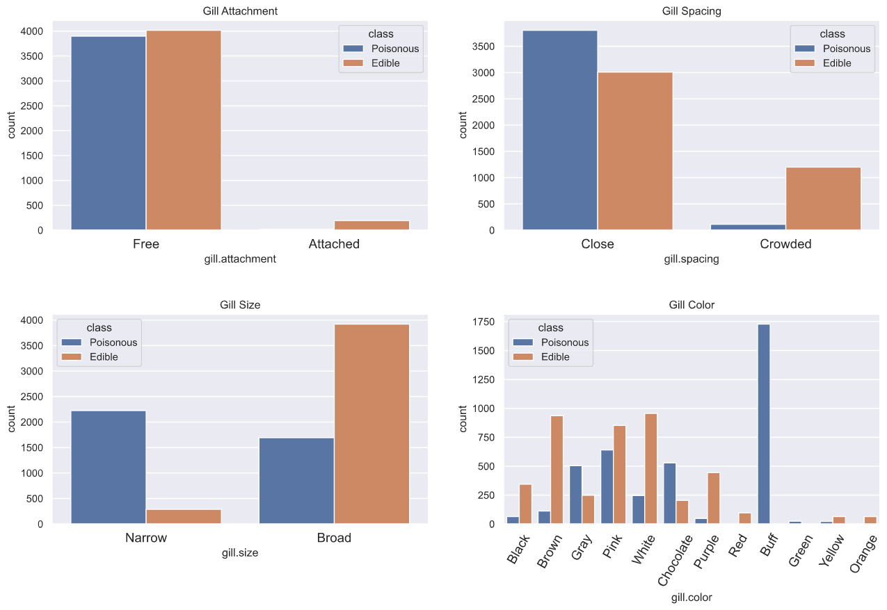
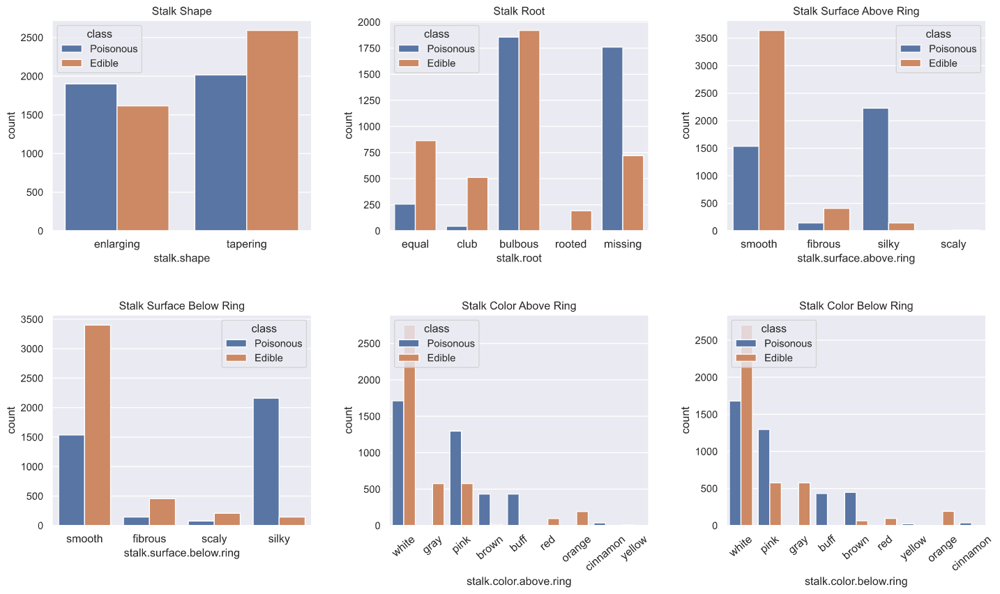
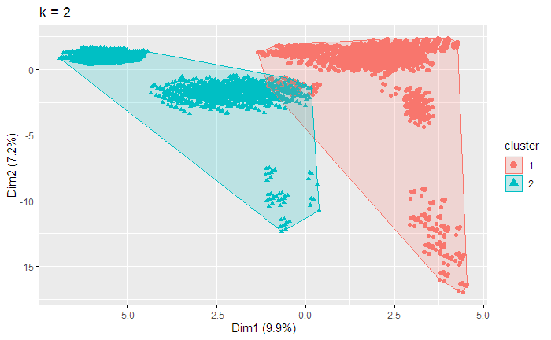

# **Introduction**


# **Data**

**Attribute Information:**

1. cap-shape: bell=b,conical=c,convex=x,flat=f, knobbed=k,sunken=s
2. cap-surface: fibrous=f,grooves=g,scaly=y,smooth=s
3. cap-color: brown=n,buff=b,cinnamon=c,gray=g,green=r, pink=p,purple=u,red=e,white=w,yellow=y
4. bruises?: bruises=t,no=f
5. odor: almond=a,anise=l,creosote=c,fishy=y,foul=f, musty=m,none=n,pungent=p,spicy=s
6. gill-attachment: attached=a,descending=d,free=f,notched=n
7. gill-spacing: close=c,crowded=w,distant=d
8. gill-size: broad=b,narrow=n
9. gill-color: black=k,brown=n,buff=b,chocolate=h,gray=g, green=r,orange=o,pink=p,purple=u,red=e, white=w,yellow=y
10. stalk-shape: enlarging=e,tapering=t
11. stalk-root: bulbous=b,club=c,cup=u,equal=e, rhizomorphs=z,rooted=r,missing=?
12. stalk-surface-above-ring: fibrous=f,scaly=y,silky=k,smooth=s
13. stalk-surface-below-ring: fibrous=f,scaly=y,silky=k,smooth=s
14. stalk-color-above-ring: brown=n,buff=b,cinnamon=c,gray=g,orange=o, pink=p,red=e,white=w,yellow=y
15. stalk-color-below-ring: brown=n,buff=b,cinnamon=c,gray=g,orange=o, pink=p,red=e,white=w,yellow=y
16. veil-type: partial=p,universal=u
17. veil-color: brown=n,orange=o,white=w,yellow=y
18. ring-number: none=n,one=o,two=t
19. ring-type: cobwebby=c,evanescent=e,flaring=f,large=l, none=n,pendant=p,sheathing=s,zone=z
20. spore-print-color: black=k,brown=n,buff=b,chocolate=h,green=r, orange=o,purple=u,white=w,yellow=y
21. population: abundant=a,clustered=c,numerous=n, scattered=s,several=v,solitary=y
22. habitat: grasses=g,leaves=l,meadows=m,paths=p, urban=u,waste=w,woods=d

Fetched from https://archive.ics.uci.edu/ml/datasets/mushroom

### **Visualization**








### **Dimension and Data Reduction**




# **Analysis**

### **model 1**
...

# **Conclusion**


# **Reference**


# **Appendix**

```{python eval=FALSE}
# Python Code ---------------------------
# library
import numpy as np 
import pandas as pd 
import matplotlib.pyplot as plt
import matplotlib as mlt
import seaborn as sns
from sklearn.preprocessing import LabelEncoder

# load data
data = pd.read_csv("mrs_one_col_reduced.csv",)
df = data.drop(columns='Unnamed: 0')

# sns setting
sns.set(rc={'figure.facecolor':'white'})

# attach full names for Cap
df_visual = df.copy()
    
cap_shape = dict(b='bell', c='conical', x='convex', f='flat', k='knobbed', s='sunken')
cap_surface = dict(f='fibrous', g='grooves', y='scaly', s='smooth')
cap_color = dict(n='brown', b='buff', c='cinnamon', g='gray', r='green', p='pink', u='purple', e='red', w='white', y='yellow')

df_visual['cap.shape'] = df_visual['cap.shape'].map(cap_shape)
df_visual['cap.surface'] = df_visual['cap.surface'].map(cap_surface)
df_visual['cap.color'] = df_visual['cap.color'].map(cap_color)

df_visual['class'] = df_visual['class'].map(dict(p='Poisonous', e='Edible'))

# Cap visualization
plt.figure(figsize=(18, 6))
plt.subplot(131)
sns.countplot(x='cap.shape', data=df_visual, hue='class')
plt.title('Cap Shape')
plt.xticks(rotation=15)

plt.subplot(132)
sns.countplot(x='cap.surface', data=df_visual, hue='class')
plt.title('Cap Surface')

plt.subplot(133)
sns.countplot(x='cap.color', data=df_visual, hue='class');
plt.title('Cap Color')
plt.xticks(rotation=40)
mlt.rc('xtick', labelsize=14) 

plt.subplots_adjust(wspace=.2)


# attach full names for Grill 
gill_attachment = dict(a='Attached', d='Descending', f='Free', n='Notched')
gill_spacing = dict(c='Close', w='Crowded', d='Distant')
gill_size = dict(b='Broad', n='Narrow')
gill_color = dict(n='Brown', b='Buff', g='Gray', r='Green', p='Pink', u='Purple', o='Orange',
                  h='Chocolate', k='Black', e='Red', w='White', y='Yellow')

df_visual['gill.attachment'] = df_visual['gill.attachment'].map(gill_attachment)
df_visual['gill.spacing'] = df_visual['gill.spacing'].map(gill_spacing)
df_visual['gill.size'] = df_visual['gill.size'].map(gill_size)
df_visual['gill.color'] = df_visual['gill.color'].map(gill_color)

# Grill visualization
plt.figure(figsize=(16, 10))

plt.subplot(221)
sns.countplot(data=df_visual, x='gill.attachment', hue='class')
plt.title('Gill Attachment')

plt.subplot(222)
sns.countplot(data=df_visual, x='gill.spacing', hue='class')
plt.title('Gill Spacing')

plt.subplot(223)
sns.countplot(data=df_visual, x='gill.size', hue='class')
plt.title('Gill Size')

plt.subplot(224)
sns.countplot(data=df_visual, x='gill.color', hue='class')
plt.title('Gill Color')
plt.xticks(rotation=60)
mlt.rc('xtick', labelsize=12)


plt.subplots_adjust(wspace=.2, hspace=.4)

# attach full names for Stalk 
stalk_shape              = dict(e='enlarging',t='tapering')
stalk_root               = {'b':'bulbous','c':'club','u':'cup','e':'equal','z':'rhizomorphs','r':'rooted', '?':'missing'}
stalk_surface_above_ring = dict(f='fibrous',y='scaly',k='silky',s='smooth')
stalk_surface_below_ring = dict(f='fibrous',y='scaly',k='silky',s='smooth')
stalk_color_above_ring   = dict(n='brown', b='buff', c='cinnamon', g='gray', o='orange', p='pink', e='red',
                                w='white', y='yellow')
stalk_color_below_ring   = dict(n='brown', b='buff', c='cinnamon', g='gray', o='orange', p='pink', e='red',
                                w='white', y='yellow')


df_visual['stalk.shape']              = df_visual['stalk.shape'].map(stalk_shape)
df_visual['stalk.root']               = df_visual['stalk.root'].map(stalk_root)
df_visual['stalk.surface.above.ring'] = df_visual['stalk.surface.above.ring'].map(stalk_surface_above_ring)
df_visual['stalk.surface.below.ring'] = df_visual['stalk.surface.below.ring'].map(stalk_surface_below_ring)
df_visual['stalk.color.above.ring']   = df_visual['stalk.color.above.ring'].map(stalk_color_above_ring)
df_visual['stalk.color.below.ring']   = df_visual['stalk.color.below.ring'].map(stalk_color_below_ring)

# Stalk visualization
plt.figure(figsize=(18, 10))

plt.subplot(231)
sns.countplot(data=df_visual, x='stalk.shape', hue='class')
plt.title('Stalk Shape')

plt.subplot(232)
sns.countplot(data=df_visual, x='stalk.root', hue='class')
plt.title('Stalk Root')

plt.subplot(233)
sns.countplot(data=df_visual, x='stalk.surface.above.ring', hue='class')
plt.title('Stalk Surface Above Ring')


plt.subplot(234)
sns.countplot(data=df_visual, x='stalk.surface.below.ring', hue='class')
plt.title('Stalk Surface Below Ring')


plt.subplot(235)
sns.countplot(data=df_visual, x='stalk.color.above.ring', hue='class')
plt.title('Stalk Color Above Ring')
plt.xticks(rotation=40)

plt.subplot(236)
sns.countplot(data=df_visual, x='stalk.color.below.ring', hue='class')
plt.title('Stalk Color Below Ring')
plt.xticks(rotation=40)
mlt.rc('xtick', labelsize=14)

plt.subplots_adjust(wspace=.3, hspace=.4)


# attach full names for Veil and Ring
veil_color  = dict(n='brown', o='orange', w='white', y='yellow')
ring_number = dict(n='none', o='one', t='two')
ring_type   = dict(c='cobwebby', e='evanescent', f='flaring', l='large', n='none', p='pendant',
                   s='sheathing', z='zone')

df_visual['veil.color']  = df_visual['veil.color'].map(veil_color)
df_visual['ring.number'] = df_visual['ring.number'].map(ring_number)
df_visual['ring.type']   = df_visual['ring.type'].map(ring_type)

# Veil and Ring visualization
plt.figure(figsize=(16, 6))

plt.subplot(131)
sns.countplot(data=df_visual, x='veil.color', hue='class')
plt.title('Veil Color')

plt.subplot(132)
sns.countplot(data=df_visual, x='ring.number', hue='class')
plt.title('Ring Number')

plt.subplot(133)
sns.countplot(data=df_visual, x='ring.type', hue='class')
plt.title('Ring Type')
plt.xticks(rotation=15)
mlt.rc('xtick', labelsize=12)


plt.subplots_adjust(wspace=.2, hspace=.4)

# attach full names for rest features
bruises           = dict(t='true', f='false')
odor              = dict(a='almond', l='anise', c='creosote', y='fishy', f='foul', m='musty', n='none', 
                         p='pungent', s='spicy')
spore_print_color = dict(k='black', n='brown', b='buff', h='chocoloate', r='green', o='Orange', u='Purple',
                        w='White', y='Yellow')
population        = dict(a='Abundant', c='Clustered', n='Numerous', s='Scattered', v='Several', y='Solitary')
habitat           = dict(g='Grasses', l='Leaves', m='Meadows', p='Paths', u='Urban', w='Waste', d='Woods')


df_visual['bruises']             = df_visual['bruises'].map(bruises)
df_visual['odor']                = df_visual['odor'].map(odor)
df_visual['spore.print.color']   = df_visual['spore.print.color'].map(spore_print_color)
df_visual['population']          = df_visual['population'].map(population)
df_visual['habitat']             = df_visual['habitat'].map(habitat)

# visualization for rest features
plt.figure(figsize=(18, 10))

labels = ['bruises', 'odor', 'spore.print.color', 'population', 'habitat']

for i, label in enumerate(labels):
    plt.subplot(2, 3, i+1)
    sns.countplot(data=df_visual, x=label, hue='class')
    plt.title(label.capitalize())
    plt.xticks(rotation=40)

mlt.rc('xtick', labelsize=14)
plt.subplots_adjust(wspace=.3, hspace=.4)

```


```{R eval=FALSE}
# R code --------------------------------
# library
set.seed(5703)
library(fastDummies)
library(ggplot2)
library(dplyr)
library(GGally)
library(gridExtra)
library(factoextra)
library(FactoMineR)
library(corrplot)
library(Rtsne)
library(class)

# load data 
mr <- read.csv("mushrooms.txt",header = T, stringsAsFactors = T)


mrm <- mr
# veil.type deleted
mrm$veil.type <- NULL
write.csv(mrm,"mrs_one_col_reduced.csv")

# one-hot encoding
mrmd <- dummy_cols(mrm,  remove_first_dummy = TRUE)
is.fact <- sapply(mrmd, is.factor)
mrmd[,is.fact] <- NULL
write.csv(mrmd,"mrs_dummied.csv")

# 75% of the sample size
smp_size <- floor(0.75 * nrow(mrm))


# store partition index
train_ind_1 <- sample(seq_len(nrow(mrm)), size = smp_size)
train_ind_2 <- sample(seq_len(nrow(mrmd)), size = smp_size)

train_1 <- mrm[train_ind_1, ]
test_1 <- mrm[-train_ind_1, ]

train_2 <- mrmd[train_ind_2, ]
test_2 <- mrmd[-train_ind_2, ]

write.csv(train_1,"raw_train.csv")
write.csv(test_1,"raw_test.csv")
write.csv(train_2,"dummied_train.csv")
write.csv(test_2,"dummied_test.csv")

# PCA + k means clustering 
clusters_1 <- kmeans(mrmd, centers = 2, nstart = 25)
fviz_cluster(clusters_1, geom = "point", axes = c(1, 2), data = mrmd)+ ggtitle("k = 2")

# t-SNE
tsne <- Rtsne(mrmd[,-1], dims = 2, perplexity=50, verbose=TRUE, max_iter = 500)

# visualizing t-SNE
colors = mrmd$class_p
colors[colors == 0] = "blue"
colors[colors == 1] = "red"
par(mgp=c(2.5,1,0))
plot(tsne$Y, t='n', main="tSNE", xlab="tSNE dimension 1", ylab="tSNE dimension 2", "cex.main"=2, "cex.lab"=1.5)
text(tsne$Y, labels=mrmd$class_p, col=colors)

```


